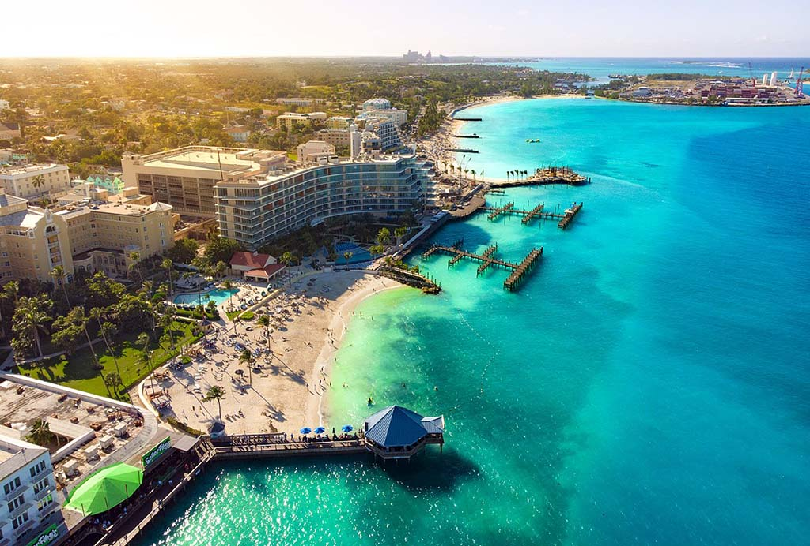

Bahamas

Sovereign: Queen Elizabeth II (1952)

Governor-General: Dame Marguerite Pindling (2014)

Prime Minister: Perry Christie (2012)

Land area: 3,888 sq mi (10,070 sq km); total area: 5,382 sq mi 13,940 sq km)

Population (2014 est.): 321,834 (growth rate: 0.87%); birth rate: 15.65/1000; infant mortality rate: 12.5/1000; life expectancy: 71.93

Capital and largest city (2011 est.): Nassau, 254,000

Monetary unit: Bahamian dollar

Languages: English (official), Creole (among Haitian immigrants)

Ethnicity/race: black 90.6%, white 4.7%, black and white 2.1%, other 1.9%, unspecified 0.7% (2010 est.)

National Holiday: Independence Day, July 10

Literacy rate: 95.6% (2011 est.)

Economic summary: GDP/PPP (2013 est.): $8.373 billion; per capita $32,000. Real growth rate: 1.9%. Inflation: 1% (2011 est.). Unemployment: 16.2%. Arable land: 0.65%. Agriculture: citrus, vegetables; poultry. Labor force: 196,900 (2011); agriculture 3%, industry 11%, tourism 49%, other services 37% (2011 est.). Industries: tourism, banking, cement, oil transshipment, salt, rum, aragonite, pharmaceuticals, spiral-welded steel pipe. Natural resources: salt, aragonite, timber, arable land. Exports: $960 million (2013 est.): mineral products and salt, animal products, rum, chemicals, fruit and vegetables. Imports: $3.245 billion (2013 est.): machinery and transport equipment, manufactures, chemicals, mineral fuels; food and live animals. Major trading partners: U.S., South Korea, Dominican Republic, India, Singapore, Ecuador, Colombia, China, Canada, Switzerland (2012).

Member of Commonwealth of Nations

Communications: Telephones: main lines in use: 137,00 (2012); mobile cellular: 254,000 (2012). Broadcast media: 2 TV stations operated by government-owned, commercially run Broadcasting Corporation of the Bahamas (BCB); multi-channel cable TV subscription service is available; about 15 radio stations operating with BCB operating a multi-channel radio broadcasting network alongside privately owned radio stations (2007). Internet hosts: 20,661 (2012). Internet users: 115,800 (2012).

Transportation: Railways: 0 km. Highways: total: 2,717 km; (2011). Ports and harbors: Freeport, Nassau, South Riding Point. Airports: 61 (2013).

International disputes: disagrees with the US on the alignment of the northern axis of a potential maritime boundary.

Geography: The Bahamas are an archipelago of about 700 islands and 2,400 uninhabited islets and cays lying 50 mi off the east coast of Florida. They extend for about 760 mi (1,223 km). Only about 30 of the islands are inhabited; the most important is New Providence (80 sq mi; 207 sq km), on which the capital, Nassau, is situated. Other islands include Grand Bahama, Abaco, Eleuthera, Andros, Cat Island, and San Salvador (or Watling's Island).

Government: Parliamentary democracy.

History: The Arawak Indians were the first inhabitants of the Bahamas. Columbus's first encounter with the New World was on Oct. 12, 1492, when he landed on the Bahamian island of San Salvador. The British first built settlements on the islands in the 17th century. In the early 18th century, the Bahamas were a favorite pirate haunt.
The Bahamas were a Crown colony from 1717 until they were granted internal self-government in 1964. The islands moved toward greater autonomy in 1968 after the overwhelming victory in general elections of the Progressive Liberal Party, led by Prime Minister Lynden O. Pindling, over the predominantly white United Bahamians Party. With its new mandate from the black population (85% of Bahamians), Pindling's government negotiated a new constitution with Britain under which the colony became the Commonwealth of the Bahama Islands in 1969. On July 10, 1973, the Bahamas became an independent nation.

